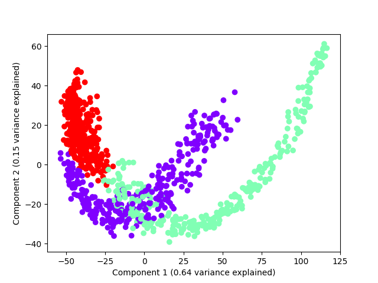

==========
Embeddings
==========

Rocket embedding
================

This example shows how PCA can be used to plot the resulting embedding

.. literalinclude:: code/rocket_embedding_pca.py

.. figure:: fig/rocket_pca.png

Random Shapelet Embedding
=========================

This example shows how PCA can be used to plot the resulting embedding

.. literalinclude:: code/random_shapelet_embedding_pca.py

Shapelet forest embedding with LR
=================================

This example shows how to compute a shapelet forest embedding for
a univariate time series dataset and use a logistic regression model
to classify new samples

.. literalinclude:: code/shapelet_forest_embedding_lr.py
   :language: python

.. figure:: fig/sfe_lr.png

Shapelet forest embedding with PCA
==================================

This example shows how PCA can be used to plot the resulting embedding

.. literalinclude:: code/shapelet_forest_embedding_pca.py

.. figure:: fig/sfe_pca.png